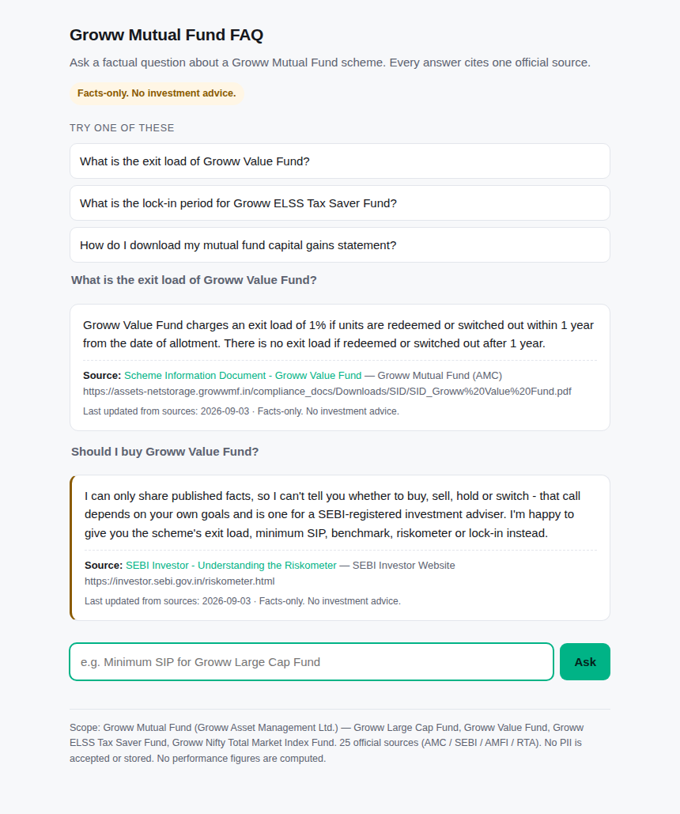

# Groww Mutual Fund FAQ — facts-only Q&A

A small retrieval-grounded FAQ assistant that answers **published facts** about Groww Mutual
Fund schemes — expense ratio, exit load, minimum SIP, ELSS lock-in, riskometer, benchmark, and
how to download statements — from **official pages only**, with **one source link on every
answer**. It refuses opinion, portfolio and performance questions, and it will not accept
personal or account data.

Product chosen for this milestone (and the next LIP challenge): **Groww**.



---

## Run it

No dependencies. Python 3.8+.

```bash
cd mf_faq
python3 -m app.server            # http://127.0.0.1:8000
```

Or from the terminal:

```bash
python3 cli.py                                          # interactive
python3 cli.py "What is the exit load of Groww Value Fund?"
python3 cli.py --json "ELSS lock-in?"                   # full response object
```

Tests:

```bash
python3 -m unittest discover -s tests -v                # 26 tests
```

HTTP API:

```bash
curl -s localhost:8000/api/scope
curl -s localhost:8000/api/ask -H 'Content-Type: application/json' \
     -d '{"question":"Minimum SIP for Groww Large Cap Fund"}'
```

---

## Scope

**AMC:** Groww Mutual Fund (Groww Asset Management Ltd.)

**Schemes (4):**

| Scheme | Category |
|---|---|
| Groww Large Cap Fund | Open-ended equity, predominantly large-cap |
| Groww Value Fund | Open-ended equity, value strategy |
| Groww ELSS Tax Saver Fund | Open-ended ELSS, 3-year statutory lock-in |
| Groww Nifty Total Market Index Fund | Open-ended index fund |

**Corpus:** 25 official pages — Groww Mutual Fund scheme pages, SIDs, KIMs, the Scheme Summary
Document, the expense-ratio and NAV disclosures, monthly factsheets, Groww platform help pages
for statements, plus SEBI, AMFI, CAMS, KFintech and MF Central reference pages. Full list with
per-source usage in [`data/sources.md`](data/sources.md) and [`data/sources.csv`](data/sources.csv).

**Questions it answers:** exit load · minimum SIP and lumpsum · benchmark · riskometer · scheme
category · ELSS lock-in · what a riskometer is · what TER is and how it's capped · where to find
the live TER · capital-gains and 80C statement downloads · Consolidated Account Statement ·
where to find SIDs, factsheets, NAV and portfolios.

Sample output for 13 questions: [`data/sample_qa.md`](data/sample_qa.md).
Disclaimer and refusal wording: [`DISCLAIMER.md`](DISCLAIMER.md).

---

## How it works

```
question
   │
   ├─ 1. PII gate ────────── PAN / Aadhaar / phone / email / OTP / folio / account number
   │                          → redact, drop the raw string, refuse, link MF Central
   │
   ├─ 2. Intent gate ─────── advice?      → refuse + SEBI investor-education link
   │                          performance? → refuse + link the official factsheet
   │
   ├─ 3. Scope gate ─────── another AMC named? → out of scope, name the four in-corpus schemes
   │
   ├─ 4. Scheme resolution ─ longest-alias-first match over scheme names and aliases
   │
   ├─ 5. Retrieval ───────── BM25 over 38 passages, restricted to
   │                          {this scheme's facts} ∪ {scheme-independent documents},
   │                          or documents only when no scheme was named
   │
   └─ 6. Answer ──────────── the retrieved passage verbatim (≤3 sentences)
                              + exactly one citation + "Last updated from sources: <date>"
```

Design decisions worth calling out:

**Retrieval, not generation.** Answers are stored passages, returned verbatim with the source
they were captured from. There is no free-text generation step, so an answer cannot drift from
its citation — the thing that makes a facts-only assistant fail in practice.

**BM25 over a hand-tagged corpus.** With ~38 passages, a lexical index beats embeddings: it is
deterministic, it costs nothing to run, and every hit is traceable to a passage id you can
inspect (`matched` is returned in the API response).

**Scope-restricted retrieval.** Once a scheme is named, only that scheme's facts are searchable.
A question about Groww Value Fund can never be answered with the Large Cap Fund's exit load.
When no scheme is named, only the scheme-independent documents are searchable — so *"what is a
riskometer?"* returns the definition, not some arbitrary scheme's reading.

**Topical-overlap check.** A passage must match at least one query term that isn't just a scheme
name. Without it, *"who is the fund manager of Groww Value Fund"* scores on the word "value"
alone and gets answered with the category fact. With it, the assistant declines.

**Other fund houses are caught before alias matching.** "SBI Bluechip" would otherwise match the
large-cap scheme's `bluechip` alias and be answered with the wrong AMC's terms.

**No TER figure is hard-coded, deliberately.** TER is revised periodically and disclosed daily.
A number frozen in a corpus is wrong within weeks and wrong *confidently*, which is worse than
useless for a support tool. Expense-ratio questions get the definition plus the AMC's live
daily-updated disclosure page. Same reasoning for NAV.

**No performance figures at all.** Returns, CAGR and comparisons are refused and redirected to
the official factsheet — the brief's "no performance claims" rule, enforced in code and asserted
in tests.

---

## Repository layout

```
mf_faq/
├── app/
│   ├── guardrails.py    PII patterns + advice/performance intent classification
│   ├── retriever.py     Okapi BM25, stdlib only
│   ├── assistant.py     the pipeline above; loads corpus.json
│   ├── server.py        stdlib HTTP server + JSON API
│   └── ui.html          single-page UI (welcome line, 3 examples, disclaimer)
├── data/
│   ├── corpus.json      25 sources, 21 scheme facts, 17 general documents
│   ├── sources.csv      generated
│   ├── sources.md       generated
│   └── sample_qa.md     generated
├── tools/
│   ├── refresh_corpus.py   re-check every source URL, archive, re-stamp
│   ├── export_sources.py   regenerate sources.csv / sources.md
│   └── export_sample_qa.py regenerate sample_qa.md
├── tests/test_assistant.py
├── cli.py
└── DISCLAIMER.md
```

`data/corpus.json` is the single source of truth. Adding a scheme or a fact means editing that
file; the source list, the sample Q&A and the UI's scope footer all derive from it.

---

## Refreshing the corpus

```bash
python3 tools/refresh_corpus.py                  # confirm all 25 URLs still resolve
python3 tools/refresh_corpus.py --save ./archive # archive each page/PDF
python3 tools/refresh_corpus.py --stamp          # re-stamp the "as of" date
python3 tools/export_sources.py
python3 tools/export_sample_qa.py
python3 -m unittest discover -s tests
```

The refresh tool does the mechanical half — confirming URLs resolve and archiving copies. **A
human still re-reads the SID/KIM and edits the facts.** Scheme terms change by addendum, not
continuously, and a wrong exit load delivered confidently is worse than a stale
"check the source" answer. Requires outbound access to `growwmf.in`, `sebi.gov.in`,
`amfiindia.com`.

---

## Known limits

1. **Corpus provenance.** The facts were captured from the official pages listed in
   `data/sources.md` on 2026-09-03, via search over those domains — the build environment's
   egress policy blocked direct HTTPS fetches to `growwmf.in`, `sebi.gov.in` and
   `amfiindia.com` (403 on CONNECT). Every URL in the corpus is a real, official page and every
   answer links to it, but the extracts have not been re-verified against a locally fetched copy
   of each PDF. **Run `python3 tools/refresh_corpus.py --save ./archive` on a machine with open
   network access and re-read the SIDs before treating any figure as authoritative.**
2. **Four schemes, one AMC.** Anything else is declined by design, not answered approximately.
3. **Facts not in the corpus** — fund manager, AUM, portfolio turnover, tracking error, stamp
   duty, cut-off timings, taxation rates — are declined rather than guessed. Each is a corpus
   addition, not a code change.
4. **Two gaps left open on purpose.** The minimum *lumpsum* for Groww Nifty Total Market Index
   Fund was not captured (only the ₹100 minimum SIP), and no TER figure is stored for any
   scheme. Both answers point at the source instead of asserting a number.
5. **Benchmark drift.** Groww ELSS Tax Saver Fund's benchmark moved from BSE 500 TRI to
   NIFTY 500 TRI w.e.f. 30 June 2025; the corpus carries the current benchmark and notes the
   change. Older PDFs still show the previous benchmark — a reminder that a dated corpus needs
   the refresh cycle above.
6. **Riskometer readings are point-in-time.** AMCs evaluate and disclose them monthly; answers
   say so and link to the scheme page.
7. **Lexical retrieval.** BM25 handles paraphrase and light morphology, not synonyms it has
   never seen. New phrasings are handled by adding keywords to a passage, not by retraining.
8. **PII detection is pattern-based.** It catches PAN, Aadhaar, Indian mobile numbers, email,
   OTP, folio and account numbers. It is a guard against accidental disclosure, not an
   adversarial filter. Nothing is logged: `server.py` suppresses the access log and the raw
   question is discarded at the boundary.
9. **Single-process prototype.** No auth, no rate limiting, loopback-bound by default.

---

## Constraints, and where each is enforced

| Constraint | Enforcement | Test |
|---|---|---|
| Public sources only | Every citation is drawn from `sources`, all on AMC/SEBI/AMFI/RTA hosts | `test_every_source_is_an_official_host` |
| One source link on every answer | `_reply()` attaches a citation on every path, refusals included | `test_every_reply_carries_exactly_one_official_citation` |
| No PII accepted or stored | Redacted at the boundary before retrieval; nothing logged | `test_pii_questions_are_refused_and_never_echoed` |
| No performance claims | Performance intent refused before retrieval | `test_performance_questions_are_refused_and_point_at_the_factsheet` |
| No advice | Advice intent refused before retrieval, with an educational link | `test_advice_is_refused_with_an_educational_link` |
| Answers ≤3 sentences | Corpus answers validated | `test_corpus_answers_stay_within_three_sentences` |
| "Last updated from sources" | Stamped on every reply from `meta` | `test_every_reply_is_stamped_and_disclaimed` |

---

**Facts-only. No investment advice.** This is a prototype built for a learning milestone. It is
not affiliated with, endorsed by, or an official channel of Groww, Groww Mutual Fund, SEBI or
AMFI. For anything concerning your own investments, consult the official scheme documents and a
SEBI-registered investment adviser.
